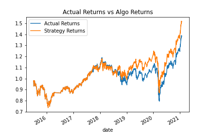
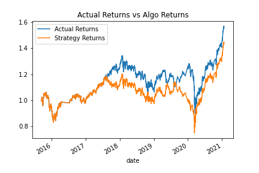
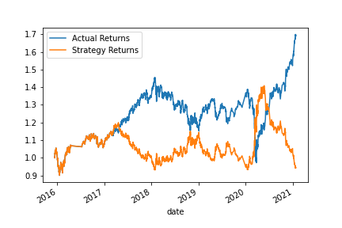

# Machine Learning Trading Bot

## Background

In this Challenge, you’ll assume the role of a financial advisor at one of the top five financial advisory firms in the world. Your firm constantly competes with the other major firms to manage and automatically trade assets in a highly dynamic environment. In recent years, your firm has heavily profited by using computer algorithms that can buy and sell faster than human traders.

The speed of these transactions gave your firm a competitive advantage early on. But, people still need to specifically program these systems, which limits their ability to adapt to new data. You’re thus planning to improve the existing algorithmic trading systems and maintain the firm’s competitive advantage in the market. To do so, you’ll enhance the existing trading signals with machine learning algorithms that can adapt to new data.

## What You're Creating

You’ll combine your new algorithmic trading skills with your existing skills in financial Python programming and machine learning to create an algorithmic trading bot that learns and adapts to new data and evolving markets.

## Instructions

Use the starter code file to complete the steps that the instructions outline. The steps for this Challenge are divided into the following sections:

* Establish a Baseline Performance
* Tune the Baseline Trading Algorithm
* Evaluate a New Machine Learning Classifier
* Create an Evaluation Report

# Evaluation

### Baseline Performance Analysis

The purpose of this analysis is to review the performance of our baseline machine learning trading bot. Our baseline parameters are; using a SVM model, 3 months of training data, 4SMA, and 100SMA. By checking our cumulative sum graph we can compare our strategy's returns to the stock's actual returns, the **actual returns are 1.387 compared to the baseline's 1.518 return.** The strategies almost mirror each other. However, our baseline strategy consistently stays a few percentage points above the actual returns. 

### Tune the Baseline Trading Algorithm
#####  Increase training dataset size
##### What impact resulted from increasing the training window?

Our tuned parameters are; using a SVM model, **6 months of training data**,  4SMA, and 100SMA. By checking our cumulative sum graph we can compare our tuned strategy's returns to the stock's actual returns, the **actual returns are 1.560 compared to the tuned model's 1.842 return.** The strategies returns are very similar initally, with actual returns being initally higher, eventually the tuned model overtakes the actual returns.

### Re-Tune the Trading Algorithm
##### Increase both SMA windows
##### What impact resulted from increasing both of the SMA windows?

Our tuned parameters are; using a SVM model, 3 months of training data, **50SMA, and 200SMA**. By checking our cumulative sum graph we can compare our re-tuned strategy's returns to the stock's actual returns, the **actual returns are 1.566 compared to the tuned model's 1.445 return.** The strategies almost mirror each other. However, our actual returns are consistently a few percentage points above the re-tuned model's returns. 

### Evaluate a New Machine Learning Model
##### Change ML Model to Logistic Regression
##### Did this new model perform better or worse than the provided baseline model? Did this new model perform better or worse than your tuned trading algorithm?

Our new parameters are; **using a Logistic Regression model**, 3 months of training data, 4SMA, and 100SMA. By checking our cumulative sum graph we can compare our re-tuned strategy's returns to the stock's actual returns, the **actual returns are 1.566 compared to the tuned model's 1.053 return.** The new Logistic Regression model performed significantly worse.

### Summary

In summary, increasing the training data sample size helped the most. This is good because we'd expect the model to be better trained with more data. Although, it might be coincidental because we missed the initial drawdown. Anyways, I'd recommend increasing training data size whenever possible.
